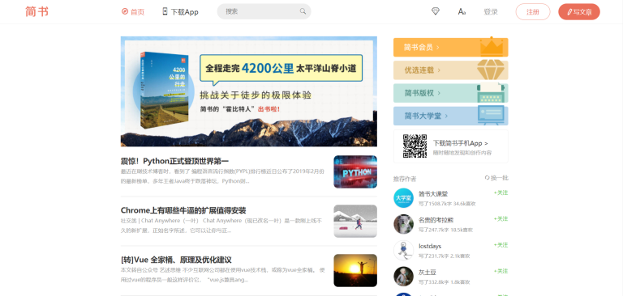

# React仿简书网站

## 简介

该项目是通过自学React，以该网站的作为学习研究的一个动手项目。

简书是一个提供写作的网站，包罗万象的专题，使得任何用户都可以在这个社区内创作，与同好交流。

该项目只是为了用React框架练手页面组件化开发，着重在熟练运用react和redux，故网站只是把基本页面和部分功能给实现了。

## 技术栈
除了React框架，还有Redux, redux-thunk, styled-components, Immutable.js, redux-immutable,react-router,react-transition-group, react-loadable等。